# Corelia Table Role & Lifecycle Audit

> Scope: read-only P1 analysis of the 68-table Main/Staging baseline captured 2026-08-23.  
> Evidence: schema snapshot `G:\Codex\attachments\0c4caf02-3b2b-4cf2-9285-2a8f9e08e7e1\pasted-text.txt`, repository migrations and callers.  
> This report is architecture mapping, not a retention policy or cleanup authorization. M1-dependent rows are labelled `M1_IN_PROGRESS` and describe the closed target contract, not deployed state.

## 1. Executive summary

- **68/68 tables classified.**
- Primary roles cover canonical entities, relations, transactions, event/audit logs, ledgers, projections, aggregates, snapshots, configuration and pending/workflow state. Exact role and secondary-role classification is recorded for all 68 rows below.
- **[FACT]** Both Main and Staging baselines contain 68 tables, 104 FKs and 38 triggers. `docs/db-baseline/baseline-context.json`.
- **[INFERENCE]** The main risk is not table count. It is ambiguous ownership where one business fact is represented in multiple mutable places: payment/access, streak state, hackathon permissions and generated snapshots.
- Retention must be decided from live age/count distribution and product/legal requirements. P1 does not infer deletion dates.

## 2. Complete table role matrix

Legend: `CE` = canonical entity, `REL` = relation, `TX` = transaction, `EV` = event log, `LED` = ledger, `PRJ` = projection, `AGG` = aggregate, `SNP` = snapshot, `CFG` = configuration, `Q` = pending/workflow.

| Table | Domain | Primary role | Secondary role | Canonical? | Writer | Mutability | Rebuildable? | Status |
| --- | --- | --- | --- | --- | --- | --- | --- | --- |
| `profiles` | Identity | CE | user state | Yes | CLIENT / STAFF_CLIENT / SERVER | MUTABLE_CURRENT_STATE | No | ACTIVE |
| `courses` | Course | CE | catalog state | Yes | STAFF_CLIENT | MUTABLE_CURRENT_STATE | No | ACTIVE |
| `course_sections` | Course | CE | ordered child | Yes | STAFF_CLIENT | MUTABLE_CURRENT_STATE | No | ACTIVE |
| `course_lessons` | Course | CE | ordered child | Yes | STAFF_CLIENT | MUTABLE_CURRENT_STATE | No | ACTIVE |
| `course_locales` | Course | CE | localized content | Yes | STAFF_CLIENT | MUTABLE_CURRENT_STATE | No | ACTIVE |
| `course_section_locales` | Course | CE | localized content | Yes | STAFF_CLIENT | MUTABLE_CURRENT_STATE | No | ACTIVE |
| `course_lesson_locales` | Course | CE | localized content | Yes | STAFF_CLIENT | MUTABLE_CURRENT_STATE | No | ACTIVE |
| `course_discounts` | Course/payment | CFG | promotion rule | Yes | STAFF_CLIENT | MUTABLE_CURRENT_STATE | No | ACTIVE |
| `enrollments` | Learning | REL | current learning state | Yes | SERVER / DATABASE_TRIGGER | MUTABLE_CURRENT_STATE | No | ACTIVE |
| `lesson_progress` | Learning | CE | current state | Yes | CLIENT | MUTABLE_CURRENT_STATE | No | ACTIVE |
| `course_payment_access` | Payment/access | PRJ | entitlement state | No — source unclear | SERVER / RPC | DERIVED_MUTABLE | PARTIALLY_REBUILDABLE | ACTIVE |
| `payment_transactions` | Payment | TX | payment history | Yes | EXTERNAL_CALLBACK / SERVER | APPEND_ONLY with status transitions | No | ACTIVE |
| `final_assignment_submissions` | Course | CE | deliverable | Yes | CLIENT | APPEND_ONLY with state/content updates | No | ACTIVE |
| `dashboard_configs` | Platform | CFG | staff dashboard config | Yes | STAFF_CLIENT | MUTABLE_CURRENT_STATE | No | ACTIVE |
| `hackathons` | Hackathon | CE | config + metrics snapshot | Yes | STAFF_CLIENT | MUTABLE_CURRENT_STATE | No | M1_IN_PROGRESS |
| `hackathon_registrations` | Hackathon | REL | application lifecycle | Yes | CLIENT / STAFF_CLIENT | MUTABLE_CURRENT_STATE | No | M1_IN_PROGRESS |
| `hackathon_access_invites` | Hackathon | Q | authorization relation | Yes for accepted invite row | STAFF_CLIENT / CLIENT | MUTABLE_CURRENT_STATE | No | M1_IN_PROGRESS |
| `hackathon_submissions` | Hackathon | CE | submitted deliverable | Yes | CLIENT | MUTABLE_CURRENT_STATE until deadline | No | M1_IN_PROGRESS |
| `hackathon_scores` | Hackathon | TX | evaluation record | Yes | STAFF_CLIENT | APPEND_ONLY with score correction | No | M1_IN_PROGRESS |
| `public_profiles` | Identity | PRJ | public profile / counters | No | DATABASE_TRIGGER | DERIVED_MUTABLE | REBUILDABLE from `profiles` and `follows` | ACTIVE |
| `career_tracks` | Career | CE | catalog state | Yes | STAFF_CLIENT | MUTABLE_CURRENT_STATE | No | ACTIVE |
| `career_track_courses` | Career | REL | track membership | Yes | STAFF_CLIENT | MUTABLE_CURRENT_STATE | No | ACTIVE |
| `projects` | Portfolio | CE | submission seed target | Yes after seed | CLIENT / DATABASE_TRIGGER | MUTABLE_CURRENT_STATE | No | M1_IN_PROGRESS |
| `project_collaborators` | Portfolio | REL | access relation | Yes | RPC | MUTABLE_CURRENT_STATE | No | ACTIVE |
| `search_query_events` | Search | EV | telemetry | Yes if active producer exists | UNKNOWN | APPEND_ONLY | No | UNKNOWN |
| `hackathon_locales` | Hackathon | CE | localized content | Yes | STAFF_CLIENT | MUTABLE_CURRENT_STATE | No | M1_IN_PROGRESS |
| `career_track_locales` | Career | CE | localized content | Yes | STAFF_CLIENT | MUTABLE_CURRENT_STATE | No | ACTIVE |
| `project_locales` | Portfolio | CE | localized content | Yes | CLIENT / STAFF_CLIENT | MUTABLE_CURRENT_STATE | No | ACTIVE |
| `user_notifications` | Notification | EV | inbox state | Yes | EDGE_FUNCTION / RPC / DATABASE_TRIGGER | APPEND_ONLY with read/resolution state | No | ACTIVE |
| `project_collaboration_invites` | Portfolio | Q | invitation history | Yes | RPC | MUTABLE_CURRENT_STATE | No | ACTIVE |
| `project_hearts` | Portfolio | REL | social event | Yes | CLIENT | INSERT/DELETE | No | ACTIVE |
| `project_comments` | Portfolio | CE | social history | Yes | CLIENT | APPEND_ONLY with soft delete | No | ACTIVE |
| `system_settings` | Platform | CFG | global configuration | Yes | STAFF_CLIENT | MUTABLE_CURRENT_STATE | No | ACTIVE |
| `credential_templates` | Credential | CE | issuance config | Yes | STAFF_CLIENT | MUTABLE_CURRENT_STATE | No | ACTIVE |
| `credential_issuances` | Credential | TX | immutable display snapshot | Yes | SERVER / STAFF_CLIENT | APPEND_ONLY with lifecycle/presentation state | No | ACTIVE |
| `ai_chat_sessions` | AI | CE | conversation summary | Yes | EDGE_FUNCTION | MUTABLE_CURRENT_STATE | PARTIALLY_REBUILDABLE from conversations | M1_IN_PROGRESS |
| `ai_conversations` | AI | EV | chat content history | Yes | EDGE_FUNCTION | APPEND_ONLY with response status update | No | M1_IN_PROGRESS |
| `ai_usage_daily` | AI | AGG | daily usage view | No | EDGE_FUNCTION / RPC | DERIVED_MUTABLE | REBUILDABLE after M1 raw-log verification | M1_IN_PROGRESS |
| `ai_usage_monthly` | AI | AGG | monthly usage view | No | EDGE_FUNCTION / RPC | DERIVED_MUTABLE | REBUILDABLE after M1 raw-log verification | M1_IN_PROGRESS |
| `tier_limits` | AI | CFG | tier entitlement config | Yes | STAFF_CLIENT / migration seed | MUTABLE_CURRENT_STATE | No | ACTIVE |
| `knowledge_chunks` | AI/RAG | PRJ | retrieval index | No | EDGE_FUNCTION | DERIVED_MUTABLE | PARTIALLY_REBUILDABLE from source content | ACTIVE |
| `user_learning_profile` | Learning/AI | AGG | derived learner profile | No | EDGE_FUNCTION | DERIVED_MUTABLE | PARTIALLY_REBUILDABLE | ACTIVE |
| `learning_observations` | Learning/AI | EV | learning evidence | Yes | EDGE_FUNCTION | APPEND_ONLY | No | ACTIVE |
| `ai_subscriptions` | AI/payment | TX | entitlement lifecycle | Yes | EXTERNAL_CALLBACK / SERVER | APPEND_ONLY with status transitions | No | ACTIVE |
| `ai_vouchers` | AI/payment | CFG | promotion rule | Yes | STAFF_CLIENT / SERVER | MUTABLE_CURRENT_STATE | No | ACTIVE |
| `ai_voucher_redemptions` | AI/payment | TX | reservation/payment link | Yes | EXTERNAL_CALLBACK / SERVER | APPEND_ONLY with lifecycle transitions | No | ACTIVE |
| `ai_voucher_batches` | AI/payment | CFG | voucher grouping | Yes | STAFF_CLIENT | MUTABLE_CURRENT_STATE | No | ACTIVE |
| `ai_usage_log` | AI | EV | successful usage evidence | Yes after M1 | EDGE_FUNCTION / RPC | APPEND_ONLY | No | M1_IN_PROGRESS |
| `ai_model_pricing` | AI | CFG | model cost config | UNKNOWN | migration seed; no repository reader found | MUTABLE_CURRENT_STATE | No | UNKNOWN |
| `course_section_questions` | Course | CE | quiz definition | Yes | STAFF_CLIENT | MUTABLE_CURRENT_STATE | No | ACTIVE |
| `section_question_attempts` | Learning | EV | learner attempt/result | Yes | CLIENT / SERVER | APPEND_ONLY with review state | No | ACTIVE |
| `notification_preferences` | Notification | CFG | user preference | Yes | CLIENT / EDGE_FUNCTION default | MUTABLE_CURRENT_STATE | No | ACTIVE |
| `course_blast_logs` | Course | AUDIT_LOG | outbound campaign audit | Yes | EDGE_FUNCTION | APPEND_ONLY | No | ACTIVE |
| `lesson_summaries` | Learning/AI | SNP | generated learning summary | No | EDGE_FUNCTION | DERIVED_MUTABLE | PARTIALLY_REBUILDABLE | ACTIVE |
| `course_co_instructor_invites` | Course | Q | invitation workflow | Yes | STAFF_CLIENT / RPC | MUTABLE_CURRENT_STATE | No | ACTIVE |
| `flashcard_decks` | Learning/AI | SNP | generated learning aid | No | EDGE_FUNCTION / CLIENT | DERIVED_MUTABLE | PARTIALLY_REBUILDABLE | ACTIVE |
| `lesson_readiness_checks` | Learning | SNP | learner readiness result | No | CLIENT / SERVER | MUTABLE_CURRENT_STATE | PARTIALLY_REBUILDABLE | ACTIVE |
| `learning_paths` | Learning/AI | SNP | generated plan | No | EDGE_FUNCTION | IMMUTABLE_SNAPSHOT with replacement | PARTIALLY_REBUILDABLE | ACTIVE |
| `follows` | Social | REL | follow source/counter source | Yes | CLIENT / DATABASE_TRIGGER | INSERT/DELETE with mute state | No | ACTIVE |
| `activity_events` | Feed | EV | public activity history | Yes | DATABASE_TRIGGER | APPEND_ONLY | No | ACTIVE |
| `pending_credential_issuances` | Credential | Q | claimable pending issuance | Yes | SERVER / DATABASE_TRIGGER | EPHEMERAL | No | ACTIVE |
| `certificate_records` | Credential | SNP | public verification record | Yes | SERVER | APPEND_ONLY with lifecycle state | No | ACTIVE |
| `email_delivery_attempts` | Email | AUDIT_LOG | provider attempt audit | Yes | EDGE_FUNCTION | APPEND_ONLY | No | ACTIVE |
| `user_daily_streaks` | Learning | AGG | current streak state | No — source unclear | RPC | DERIVED_MUTABLE | PARTIALLY_REBUILDABLE from claims/ledger | ACTIVE |
| `user_daily_streak_claims` | Learning | EV | daily claim evidence | Yes | RPC | APPEND_ONLY | No | ACTIVE |
| `user_point_ledger` | Learning | LED | point history | Yes | RPC / DATABASE_TRIGGER | APPEND_ONLY | No | ACTIVE |
| `user_streak_milestone_unlocks` | Learning | REL | one-time milestone evidence | Yes | RPC | APPEND_ONLY | No | ACTIVE |
| `learning_reminder_logs` | Learning | AUDIT_LOG | reminder send/skip audit | Yes | CRON / EDGE_FUNCTION | APPEND_ONLY | No | ACTIVE |

## 3. Canonical vs derived matrix

| Data | Canonical source | Derived/snapshot location | Rebuildable | Sync mechanism |
| --- | --- | --- | --- | --- |
| Public-facing profile | `profiles` | `public_profiles` | Yes | profile/follow triggers |
| Follow/follower count | `follows` | profile/course/hackathon/project counter fields | Yes | database triggers |
| Project heart count | `project_hearts` | `projects.like_count` | Yes | database trigger |
| Course/hackathon/project locale content | respective `*_locales` rows | UI selection | No — locale row is canonical | direct client/RLS writes |
| AI successful usage | `ai_usage_log` | `ai_usage_daily`, `ai_usage_monthly` | Yes only after M1 full raw-log validation | M1 atomic RPC target |
| AI retrieval corpus | source lesson/course content | `knowledge_chunks` | Partial | embedding Edge Function |
| Learner profile | observations + learning history | `user_learning_profile` | Partial | AI Edge Function |
| Hackathon metrics | registrations/submissions/scores | `hackathons.document.metrics_snapshot` | Yes | explicit refresh function/client flow |
| Credential display | issuance-time source values | `credential_issuances.display_snapshot` | No by design | issuance workflow |
| Project from submission | source submission at creation only | `projects` | No after owner edit | seed-once trigger, M1 target |
| Daily streak | daily claim/point evidence | `user_daily_streaks`, potentially `profiles.streak_days` | Partial | RPC; profile ownership unknown |

## 4. Writer ownership matrix

| Table / fact | Expected writer | Actual writer found | Conflict? |
| --- | --- | --- | --- |
| `public_profiles` projection | DATABASE_TRIGGER | trigger/backfill migrations | No; add drift observability |
| Follow counters | DATABASE_TRIGGER | follow triggers | No |
| `projects` seeded from submission | DATABASE_TRIGGER once, owner afterwards | submission trigger + owner client | No under closed C-06 contract; `M1_IN_PROGRESS` |
| `ai_usage_*` aggregates | one server-side aggregate owner | historical Edge Function code; M1 RPC target | **Yes until M1 deploy/validation** |
| Hackathon staff authorization | `hackathon_access_invites` | invite rows plus `hackathons.document` email arrays | **Yes** |
| Hackathon metrics snapshot | one refresh owner | explicit client/library refresh | **Yes — refresh cadence unclear** |
| Session message count | one defined aggregate owner | Edge Function success path only | **Yes — invariant unclear** |
| Payment/access fact | payment transaction plus defined access projection | transaction, enrollment fields, `course_payment_access` | **Yes — source map missing** |
| Streak current value | one derived current-state table | `user_daily_streaks` and `profiles.streak_days` | **Yes — sync owner unknown** |

## 5. Dependency graph

```mermaid
flowchart TD
  Profiles[profiles] --> PublicProfiles[public_profiles]
  Follows[follows] --> PublicProfiles
  Follows --> CounterFields[follower/following counters]

  Courses[courses] --> Sections[course_sections] --> Lessons[course_lessons]
  Courses --> Enrollments[enrollments]
  Courses --> CourseAccess[course_payment_access]
  Payment[payment_transactions] -. payment/access evidence .-> CourseAccess
  Courses --> Credentials[credential_templates] --> Issuances[credential_issuances]
  Credentials --> Pending[pending_credential_issuances]
  Courses --> Certificates[certificate_records]

  Hackathons[hackathons] --> Registrations[hackathon_registrations]
  Hackathons --> Submissions[hackathon_submissions]
  Submissions -. M1 seed once .-> Projects[projects]
  Registrations --> Metrics[metrics_snapshot]
  Submissions --> Metrics
  Scores[hackathon_scores] --> Metrics
  AccessInvites[hackathon_access_invites] -. authorization .-> Scores

  Conversations[ai_conversations] -. M1 successful outcome .-> UsageLog[ai_usage_log]
  UsageLog --> UsageDaily[ai_usage_daily]
  UsageLog --> UsageMonthly[ai_usage_monthly]
  SourceContent[course/lesson content] -. embedding .-> Chunks[knowledge_chunks]
  Conversations --> Observations[learning_observations] --> LearningProfile[user_learning_profile]

  Claims[user_daily_streak_claims] --> Streaks[user_daily_streaks]
  Claims --> Ledger[user_point_ledger]
```

Solid edges are FK or source ownership where evidenced in the schema. Dashed edges are trigger, aggregate, snapshot or closed target-contract dependencies.

## 6. Mutability / history matrix

| Table group | Mutable | Append-only / snapshot rule | Concern |
| --- | --- | --- | --- |
| `payment_transactions`, `ai_subscriptions`, `ai_voucher_redemptions` | Lifecycle state only | Keep payment facts/history | No final retention/delete rule may be inferred. |
| `credential_issuances`, `certificate_records` | Presentation/revocation/mint lifecycle only | Issuance/display facts must remain historical snapshots | Split mutable lifecycle from immutable issuance fact in a future invariant task. |
| `activity_events`, `course_blast_logs`, `email_delivery_attempts`, `learning_reminder_logs`, `user_point_ledger`, `user_daily_streak_claims` | No ordinary content mutation found | Append-only | Retention and PII policy absent. |
| `ai_conversations` | assistant placeholder/status mutates | Conversation content is historical user data | Define privacy retention and failed-request treatment. |
| `project_comments` | soft delete | Content should not be rewritten after creation | Existing soft-delete behavior is compatible with history. |
| `learning_paths`, `flashcard_decks`, `lesson_summaries` | replacement/regeneration | Generated snapshot may become stale | Need stale/refresh lifecycle, not silent overwrite. |
| `project_collaboration_invites`, `course_co_instructor_invites`, `pending_credential_issuances` | state/consume | Pending rows need expiry/cleanup rules | No authorization to delete under P1. |

## 7. Retention candidates

These are classifications only; **not deletion proposals**.

| Table | Suggested class | Reason | Decision needed |
| --- | --- | --- | --- |
| `credential_issuances`, `certificate_records`, `payment_transactions`, `user_point_ledger` | KEEP_FOREVER | credential, financial or ledger history | legal/audit retention owner |
| `ai_voucher_redemptions`, `ai_subscriptions`, `course_blast_logs`, `activity_events` | LONG_TERM_HISTORY | transaction/audit/feed evidence | retention duration and access scope |
| `profiles`, enrollments, progress, projects, conversations | USER_LIFETIME | user-owned ongoing state/content | account deletion/export policy |
| `public_profiles`, counters, `ai_usage_daily/monthly`, `knowledge_chunks` | REBUILDABLE or PARTIALLY_REBUILDABLE | projections/aggregates | prove raw source completeness first |
| invite/pending tables, `search_query_events`, `email_delivery_attempts`, `learning_reminder_logs` | SHORT_TERM candidate | operational/pending/telemetry data | live age distribution, privacy and audit need |
| `pending_credential_issuances` | PURGE_CANDIDATE after expiry policy | unclaimed records can remain indefinitely | TTL, notification/retry and claim rule |

## 8. Duplicate state findings

### Valid duplication

- `profiles` → `public_profiles`: public-safe projection.
- `follows` → follower/following counts: trigger-maintained aggregate.
- `project_hearts` → `projects.like_count`: trigger-maintained aggregate.
- `credential_issuances.display_snapshot`: immutable issuance-time presentation snapshot.
- `ai_usage_log` → daily/monthly tables: valid aggregate **only after M1 verifies complete raw successful usage**.
- submission → project: valid one-time seed, then intentionally independent under C-06.

### Suspicious duplication / ambiguous ownership

1. **P1 — payment/access mapping:** `payment_transactions`, payment fields on `enrollments`, `course_payment_access`, and certificate state represent related facts without a documented canonical mapping.
2. **P2 — hackathon authorization:** accepted `hackathon_access_invites` and email role arrays inside `hackathons.document` are two mutable sources for roles.
3. **P2 — streak current state:** `user_daily_streaks` and `profiles.streak_days` both look like current streak representations; writer/sync owner for the latter is unknown.
4. **P2 — hackathon metrics:** `metrics_snapshot` duplicates registration/submission/score totals but no automatic refresh ownership was found.
5. **P2 — session message count:** `ai_chat_sessions.message_count` does not yet have a documented invariant against persisted conversation rows.
6. **P1 — AI entitlement:** `ai_subscriptions` and `profiles.tier` are both mutable tier inputs. The AI guard prefers an active subscription but falls back to the profile tier; no repository expiry-reset job was found. External worker behavior remains unknown.

## 9. Orphan / legacy candidates

| Object | Evidence | Status | Risk before cleanup |
| --- | --- | --- | --- |
| `search_query_events` | No direct writer/reader found in `src`, Edge Functions or scripts scan; schema table exists. | UNKNOWN | Could have RPC, analytics or external producer outside repository. |
| `ai_model_pricing` | Seeded in migration; current usage accounting calculates cost in code and no repository reader was found. | UNKNOWN | Could be intended future configuration or external reader. |
| `offline_*` tables | Explicitly dropped in released migration history. | LEGACY_REMOVED | Do not recreate from historical references. |
| `contest_*` naming | Released migration renamed physical tables to `hackathon_*`; legacy vocabulary remains compatibility input. | LEGACY_ACTIVE / M1_IN_PROGRESS | Do not global rename or clean up before M1 compatibility evidence. |

## 10. Pending / temporary lifecycle

| Table | Created | Consumed/resolved | Cleanup evidence | Risk |
| --- | --- | --- | --- | --- |
| `pending_credential_issuances` | issue to email before matching user exists | new-user claim trigger consumes it | no TTL/expiry evidence found | unclaimed rows may persist indefinitely |
| `project_collaboration_invites` | collaboration RPC | accept/decline/revoke; expiry checked on action | no background expiry transition found | stale pending inbox/workflow state |
| `course_co_instructor_invites` | staff invite flow | accepted/declined/revoked | expiry/cleanup requires confirmation | stale authorization invitation |
| `hackathon_access_invites` | manager grants role invite | accepted/declined/revoked | expiry/cleanup requires confirmation | stale role invitation |
| `ai_voucher_redemptions` | reservation before payment completion | `paid` or `released` payment lifecycle | no retention decision | deleting vouchers/batches during reservation is integrity-sensitive |

## 11. Structural smells

| ID | Smell | Evidence | Priority |
| --- | --- | --- | --- |
| P1-01 | Payment/access graph has no documented canonical join path. | Multiple state tables; snapshot shows `payment_transactions` only FK to user, while course access is separate. | P1 |
| P2-01 | Multiple mutable hackathon authorization representations. | invite-role rows plus document email arrays drive different consumers. | P2 |
| P2-02 | Projection snapshot refresh ownership is unclear. | `metrics_snapshot` is derived from primary tables but written by explicit refresh flow. | P2 |
| P2-03 | Current streak state has ambiguous source. | `user_daily_streaks` and `profiles.streak_days`. | P2 |
| P2-04 | AI model pricing table and code rate calculation are disconnected. | Migration seeds `ai_model_pricing`; `estimateCostUsd` hardcodes rates. | P2 |
| P3-01 | Generated learning snapshots have no stale/refresh lifecycle. | `learning_paths`, summaries and flashcards are generated from mutable sources. | P3 |
| P3-02 | Pending workflow expiry is mainly lazy/action-based. | collaboration invite expiry is checked on acceptance; no scheduler found. | P3 |
| P3-03 | Event/audit retention ownership is absent from repository. | no cleanup job found for high-growth log groups. | P3 |
| P4-01 | `search_query_events` has no in-repository consumer. | repository scan only; live/external usage unknown. | P4 |

## 12. Cleanup candidates

| Candidate | Evidence | Potential benefit | Risk | Required validation |
| --- | --- | --- | --- | --- |
| `search_query_events` | no repository reader/writer found | reduce unused schema/data if inactive | external analytics/RPC may use it | live query logs, RPC/function catalog, external consumer owner |
| `ai_model_pricing` | no repository reader; hardcoded cost calculation remains | remove unused config or wire canonical config | pricing/reporting may depend on it externally | source-of-truth decision, live catalog and external consumer check |
| expired pending credential rows | no TTL evidence | reduce stale personal/contact data | user may register/claim later | business claim window, notification/retry policy, data sample |
| resolved invite rows | no retention policy | reduce inbox/workflow noise | audit/support history may be needed | support/audit requirements and live age distribution |

## 13. Findings priority

| ID | Finding | Priority | Impact | User impact | Future task |
| --- | --- | --- | --- | --- | --- |
| P1-01 | Payment/access canonical mapping absent | P1 | payment integrity, entitlement traceability | wrong/missing access becomes difficult to explain or repair | BUSINESS_INVARIANT |
| P1-02 | Voucher batch deletion may cascade a reserved redemption | P1 | payment/discount audit integrity | checkout history may become untraceable during a dispute | BUSINESS_INVARIANT |
| P1-03 | AI paid-tier entitlement has two mutable inputs | P1 | expired access/quota may persist if profile fallback is stale | user may retain or lose paid capability incorrectly | SOURCE_OF_TRUTH |
| P2-01 | Hackathon access has two mutable sources | P2 | authorization/UI divergence | user can see a role that DB does not honor, or inverse | SOURCE_OF_TRUTH |
| P2-02 | Streak source is ambiguous | P2 | learner state / AI context drift | displayed/advised streak can be stale | SOURCE_OF_TRUTH |
| P2-03 | Hackathon metrics snapshot refresh ownership unclear | P2 | stale analytics | users/admins see outdated totals | OBSERVABILITY |
| P2-04 | AI pricing config is not runtime canonical | P2 | cost telemetry drift | usage/cost reporting may be inaccurate | SOURCE_OF_TRUTH |
| P2-05 | AI session count invariant unclear | P2 | derived conversation metadata drift | history/count UI can misrepresent stored messages | BUSINESS_INVARIANT |
| P3-01 | Pending credential lifecycle has no verified TTL | P3 | stale personal/contact data | old pending records may persist | RETENTION |
| P3-02 | Generated learning snapshots lack stale policy | P3 | maintainability/content drift | user can receive outdated guidance | STATE_MACHINE |
| P3-03 | Log/event retention owner unknown | P3 | storage/privacy/slow queries | indirect performance/privacy impact | RETENTION |
| P4-01 | `search_query_events` usage unknown | P4 | cleanup opportunity | none until false-positive is ruled out | CLEANUP |

## 14. Unknowns

1. Exact live RLS, function and trigger definitions after the 2026-08-23 snapshot; P1 did not query or write either database.
2. External workers, analytics or scheduled jobs outside this repository that may access `search_query_events`, `ai_model_pricing`, streak fields or logs.
3. Live row counts, age distributions, stale pending counts and retention/legal requirements.
4. Historical completeness of `ai_usage_log` before M1; do not call historical aggregate data fully rebuildable yet.
5. The explicit canonical relation between a payment transaction, course access, enrollment and credential issuance.
6. Whether legacy role email arrays are a deliberate external integration boundary or merely UI cache.

## 15. Recommended follow-up tasks

| Track | Scope |
| --- | --- |
| BUSINESS_INVARIANT | Payment transaction → access/enrollment/certificate mapping; voucher deletion versus reserved redemption; AI session count definition. |
| SOURCE_OF_TRUTH | Hackathon authorization roles; streak current state; AI model pricing configuration. |
| OBSERVABILITY | Public-profile projection drift, hackathon metrics refresh and payment/access traceability. |
| STATE_MACHINE | Pending invitations, pending credential issuance and generated-learning snapshot staleness. |
| RETENTION | Event/audit/inbox/AI conversation/Pending-credential retention classifications using live data and privacy requirements. |
| CLEANUP | Validate external usage before any action on `search_query_events` or `ai_model_pricing`; no drop is authorized. |
| PERFORMANCE | Only after table ownership is closed: use workload/query data to assess high-growth logs and aggregates. |

## Evidence notes

- **[FACT]** Table count and baseline object counts: `docs/db-baseline/baseline-context.json`.
- **[FACT]** Table fields, PKs and FKs: current schema snapshot at `G:\Codex\attachments\0c4caf02-3b2b-4cf2-9285-2a8f9e08e7e1\pasted-text.txt`.
- **[FACT]** Trigger-derived counters and feed mechanisms: `supabase/migrations/20260611100000_project_hearts_comments.sql`, `supabase/migrations/20260702000000_activity_feed_follow_system.sql`.
- **[FACT]** M1 target contracts are read from the current working-tree migrations and are not reported as deployed runtime truth.
- **[INFERENCE]** Roles, rebuildability and retention labels are intentionally conservative where no raw history, writer or live operational evidence exists.
